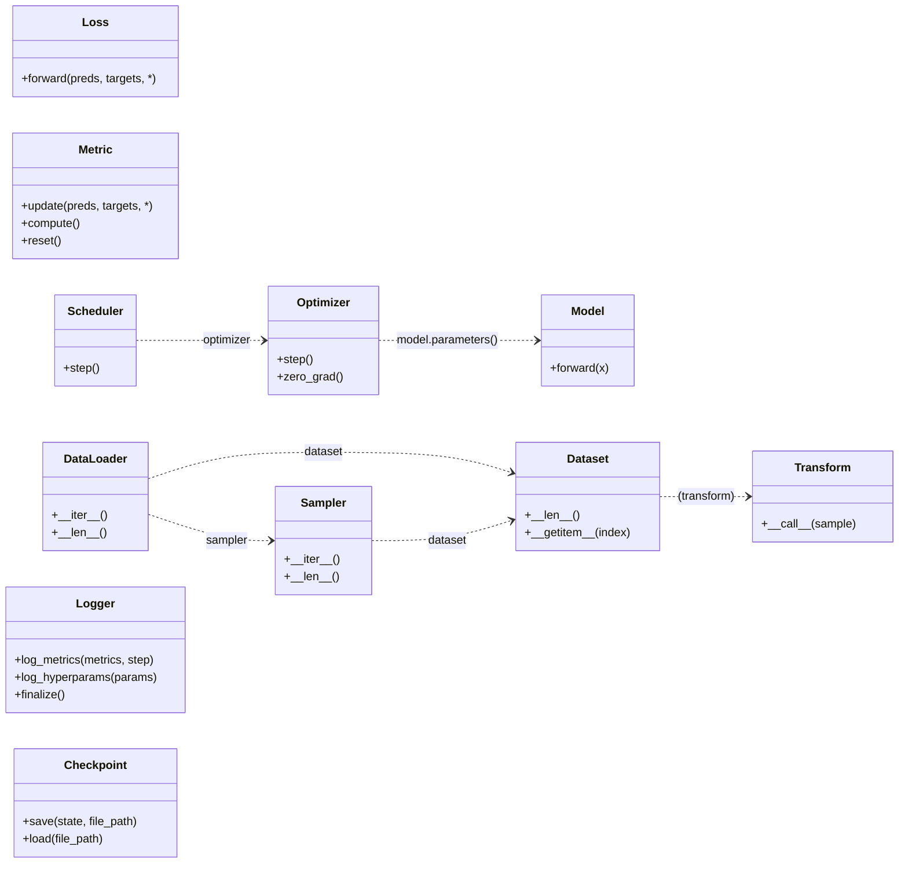

# CVLab-Kit

PyTorch 기반의 경량 모듈형 프로토타이핑 프레임워크


## Overview

이 프로젝트는 PyTorch 기반의 경량 모듈형 실험 프레임워크로, **에이전트(Agent) 중심 구조**를 바탕으로 실험 구성 요소(Component)들을 **Creator 클래스를 통해 동적으로 생성**하며, 설정 파일(YAML)을 기반으로 재현성과 구성 유연성을 모두 갖춘 실험 환경을 제공합니다.


## Design Philosophy

CVLab-Kit은 실험의 **목적(Why)** 과 그것을 구현하는 **방법(How)** 을 명확하게 분리하는 것을 핵심 설계 철학으로 삼습니다.

-   **Agent (The "Why")**: 실험의 **목적**과 **전체 시나리오**를 정의합니다. `ClassificationAgent`는 '분류를 하겠다'는 목적을, `FixMatchAgent`는 'FixMatch 기법으로 학습하겠다'는 목적을 나타냅니다. 학습, 평가, 데이터 처리의 모든 흐름은 Agent가 지휘합니다.
-   **Component (The "How")**: 실험에 필요한 **재사용 가능한 도구**입니다. `resnet18` 모델, `Adam` 옵티마이저, `mstar` 데이터셋 등은 모두 특정 목적을 달성하기 위한 구체적인 '방법'에 해당합니다.
-   **Config (The Bridge)**: YAML 설정 파일은 이 둘을 연결하는 **설계도**입니다. Agent에게 어떤 도구(Component)들을 주입하여 시나리오를 완성할지 결정합니다.

이러한 구조 덕분에, 사용자는 새로운 '방법(Component)'을 추가하더라도 기존의 '목적(Agent)' 코드를 수정할 필요가 없으며, 반대로 새로운 '목적(Agent)'을 설계할 때 기존의 검증된 '도구(Component)'들을 재사용할 수 있습니다.


## Key Features

| 기능 | 설명 |
| --- | --- |
| **Agent-Centric Workflow** | 학습, 검증, 평가 루프를 에이전트 중심으로 관리합니다. |
| **Dynamic Component Factory** | `create.<component>.<key>()` 형태로 컴포넌트를 동적으로 로딩 및 생성합니다. |
| **Dry-run & Template Generation** | 학습 시작 전, 설정 파일의 유효성을 검증합니다. 누락된 키가 있을 경우, 필요한 항목이 포함된 설정 템플릿(`generated_basic.yaml`)을 자동으로 생성하여 오류를 방지합니다. |
| **Grid Search** | YAML에 리스트 형태로 정의된 하이퍼파라미터 조합을 자동으로 확장하여 실험을 수행합니다. |
| **Zero-Boilerplate Components** | `InterfaceMeta`를 통해 컴포넌트 구현 시 반복적인 코드를 제거하고 구조를 자동으로 통일합니다. |


## Component Interface System

모든 컴포넌트(Optimizer, Model, Loss 등)는 `InterfaceMeta`라는 커스텀 메타클래스를 통해 구현됩니다. 이 시스템은 개발자가 최소한의 코드로 컴포넌트를 구현할 수 있도록 두 가지 주요 패턴을 지원합니다.

### 1. 직접 구현 (Direct Implementation)

- **설명**: `torch.nn.Module`와 같은 클래스를 상속받고, 필요한 모든 기능을 처음부터 직접 구현하는 방식입니다.
- **예시**:
    ```python
    from cvlabkit.component.base import Loss
    import torch.nn.functional as F

    class MyCustomLoss(Loss):
        def __init__(self, cfg):
            super().__init__()
            self.alpha = cfg.get("alpha", 0.25)

        def forward(self, predictions, targets):
            # 직접 정의한 손실 계산 로직
            example = F.binary_cross_entropy(predictions, targets) * self.alpha
            return example
    ```

### 2. 위임 / 합성 (Delegation / Composition)

- **설명**: `torch.optim.Adam`과 같은 기존 라이브러리 객체를 내부적으로 생성하고, 구현하지 않은 나머지 기능들은 해당 객체에 자동으로 위임하는 방식입니다. 일부 기능만 선택적으로 변경(오버라이드)할 수도 있어 매우 효율적입니다.
- **예시**:
    ```python
    import torch.optim as optim
    from cvlabkit.component.base import Optimizer

    class AdamWithLogging(Optimizer):
        def __init__(self, cfg, parameters):
            lr = cfg.get("lr", 1e-3)
            # 무한 재귀를 피하기 위해 self.opt 와 같이 다른 이름으로 할당
            self.opt = optim.Adam(parameters, lr=lr)

        def step(self):
            # step 메서드는 직접 오버라이드하여 기능 변경
            print("Performing an optimization step...")
            self.opt.step()
    ```
    *위 예시에서 `step`은 직접 구현한 코드가 실행되고, `InterfaceMeta`의 작동 원리에 의해, `zero_grad`와 같은 다른 모든 메서드는 `self.opt`의 것이 자동으로 호출됩니다.*


## Installation

### 1. uv 설치

```bash
pip install uv
```

### 2. 프로젝트 클론

```bash
git clone https://github.com/deveronica/cvlab-kit.git && cd cvlab-kit
```

### 3. 의존성 설치

```bash
uv sync
```

## Quick Start

### 1. 설정 파일 준비

- **방법 A (추천): Dry-run으로 템플릿 생성**
    - 사용하려는 Agent와 Component들을 지정하여 `main.py`를 실행합니다.
    - `--fast` 옵션 없이 실행하면, `Creator`가 필요한 모든 설정을 자동으로 추적하여 `config/templates/generated_basic.yaml` 파일을 생성해줍니다.
        ```bash
        uv run main.py --config config/minimal_config.yaml
        ```
- **방법 B: 기본 템플릿 스크립트 사용**
    - `python3 config/generate_template.py`를 실행하여 가장 기본적인 `generated_basic.yaml` 파일을 생성할 수 있습니다. 모든 Agent와 Component의 cfg 변수가 담겨있어, 사용에 주의가 필요합니다.

### 2. 설정 파일 수정

생성된 템플릿이나 `config/example.yaml`을 참고하여 원하는 실험 구성을 작성합니다.

### 3. 실험 실행

`--fast` 옵션을 사용하여 설정 검증을 건너뛰고 바로 실험을 시작합니다.

```bash
uv run main.py --config config/example.yaml --fast
```


## Component Dependency Diagram

다음은 CVLab-Kit의 핵심 컴포넌트 간의 주요 생성자 의존성을 나타낸 다이어그램입니다. 각 컴포넌트는 독립적으로 정의되지만, 생성 시점에 다른 컴포넌트를 필요로 하는 경우가 있습니다.




## Documentation

더 자세한 내용은 다음 문서를 참조하세요:

- [아키텍처 개요](docs/architecture.md)
- [개발 철학](docs/development_philosophy.md)
- [설정 가이드](docs/config_guide.md)
- [Creator 동작 방식](docs/creator_workflow.md)
- [컴포넌트 확장](docs/extending_components.md)
- [추가 라이브러리](docs/additional_libraries.md)
