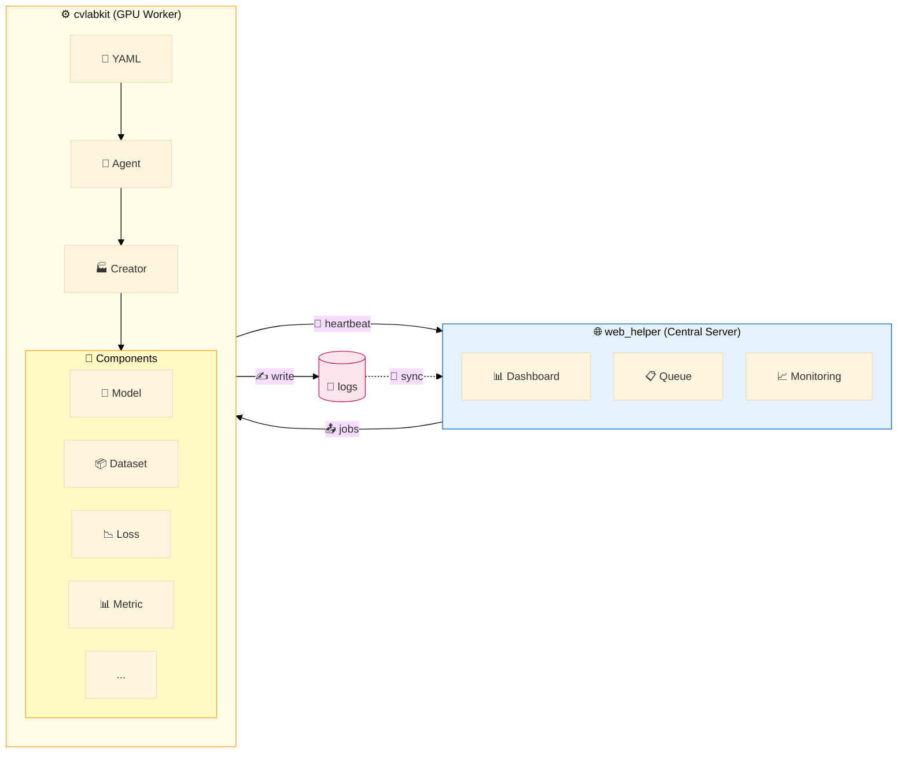
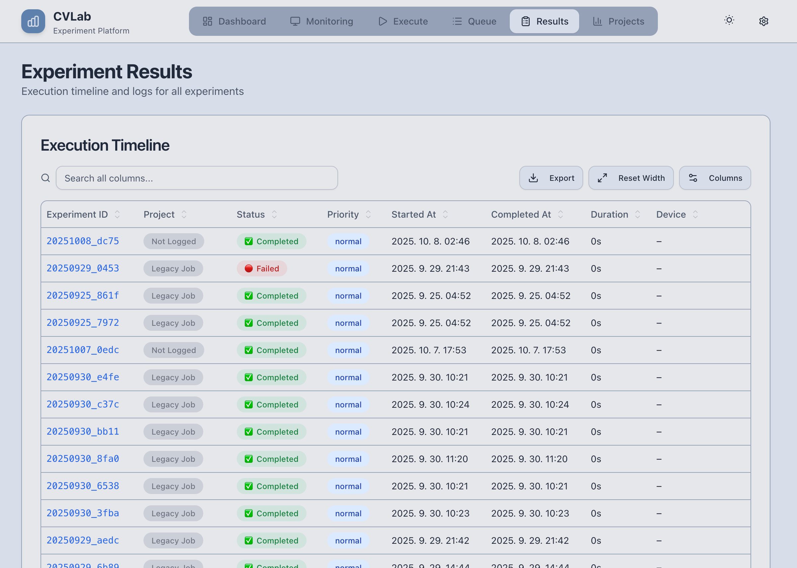

# CVLab-Kit

[](https://deveronica.github.io/cvlab-kit)
[](https://www.python.org/downloads/)
[](https://pytorch.org/)
[](https://github.com/astral-sh/ruff)

**PyTorch 기반 모듈형 ML 실험 프레임워크 + 웹 기반 연구 관리 플랫폼**



> `web_helper`가 작업 배포 → `cvlabkit`이 실험 실행 후 `logs/`에 기록 → `web_helper`가 동기화하여 시각화

---

## Overview

- **cvlabkit**: PyTorch 기반 CLI 실험 엔진
  - Agent: 실험 오케스트레이션 (classification, fixmatch, rectified_flow 등)
  - Component: 재사용 가능한 ML 컴포넌트 (model, loss, dataset, transform 등)
  - Creator: YAML 설정 기반 동적 컴포넌트 팩토리
- **web_helper**: 실시간 실험 모니터링 및 결과 분석 웹 UI

---

## Quick Start

```bash
# 설치
git clone https://github.com/deveronica/cvlab-kit.git
cd cvlab-kit
uv sync

# CLI 실험 실행
uv run main.py --config config/example.yaml --fast

# 웹 UI 실행
uv run app.py --dev
# → http://localhost:5173
```

<p align="center">
  
  
</p>

---

## Key Features

### YAML 기반 설정
```yaml
run_name: "cifar10_resnet"
model: resnet18
optimizer: adam
lr: [0.001, 0.01]  # Grid Search: 2개 실험 생성
transform:
  train: "random_crop | random_flip | normalize"
```

### 컴포넌트 시스템
```python
from cvlabkit.component.base import Loss

class FocalLoss(Loss):
    def __init__(self, cfg):
        self.gamma = cfg.get("gamma", 2.0)

    def forward(self, pred, target):
        # 구현
```

### 분산 실행
```bash
# 중앙 서버 (Synology NAS 등)
uv run app.py --server-only

# GPU 워커
uv run app.py --client-only --url http://server:8000 --full
```

---

## Project Structure

```
cvlab-kit/
├── cvlabkit/
│   ├── agent/          # 실험 에이전트 (14개)
│   ├── component/      # ML 컴포넌트
│   │   ├── base/       # 베이스 클래스
│   │   ├── model/      # ResNet, WideResNet, U-Net 등
│   │   ├── loss/       # CrossEntropy, LPIPS 등
│   │   ├── dataset/    # CIFAR, ImageFolder, YOLO 등
│   │   ├── transform/  # RandAugment, AugMix 등
│   │   └── ...
│   └── core/           # Creator, Config (DO NOT MODIFY)
├── web_helper/         # 웹 UI (FastAPI + React)
├── config/             # 실험 설정 파일
└── docs/               # MkDocs 문서
```

---

## Documentation

전체 문서: **[https://deveronica.github.io/cvlab-kit](https://deveronica.github.io/cvlab-kit)**

| 문서 | 설명 |
|------|------|
| [빠른 시작](docs/getting_started.md) | 설치 및 첫 실험 |
| [아키텍처](docs/architecture.md) | 시스템 구조 |
| [설정 가이드](docs/config_guide.md) | YAML 설정 문법 |
| [컴포넌트 확장](docs/extending_components.md) | 새 컴포넌트 추가 |
| [분산 실행](docs/distributed_execution_guide.md) | 다중 GPU 통합 |

---

## Development

```bash
# Lint & Format
ruff check . && ruff format .

# Frontend
cd web_helper/frontend && npm run dev
```

---

## License

Copyright (c) 2025 CVLab-Kit Team. All rights reserved.
