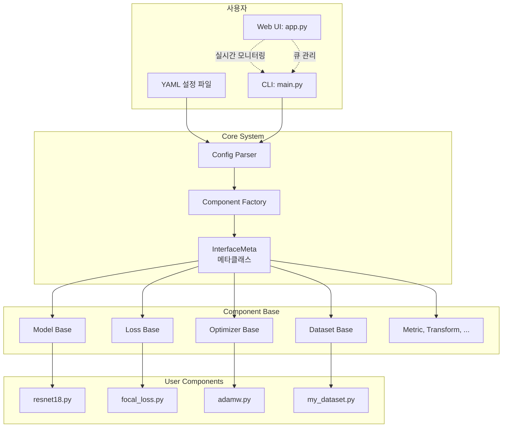

# CVLab-Kit

[](https://deveronica.github.io/cvlab-kit)
[](https://www.python.org/downloads/)
[](https://pytorch.org/)
[](https://github.com/astral-sh/ruff)

**PyTorch 기반 모듈형 ML 실험 프레임워크 + 웹 기반 연구 관리 플랫폼**

<p align="center">
  
</p>

---

## 🎯 Overview

머신러닝 연구를 위한 **모듈형 실험 프레임워크**입니다. YAML 설정 파일 기반의 재현 가능한 실험 환경과 웹 기반 실험 관리 도구를 제공합니다.

### 주요 구성 요소

- **cvlabkit**: PyTorch 기반 CLI 실험 엔진
  - `component/base/`: 재사용 가능한 ML 컴포넌트 베이스 클래스
  - `core/`: 동적 컴포넌트 로딩 및 설정 관리 시스템
- **web_helper**: 실시간 실험 모니터링 및 결과 분석 웹 UI

---

## ✨ Key Features

### 🧩 모듈형 컴포넌트 시스템
- **베이스 클래스 상속**: `Model`, `Loss`, `Metric`, `Dataset` 등 표준화된 인터페이스
- **동적 로딩**: YAML 설정에서 컴포넌트 이름만 지정하면 자동 로드
- **두 가지 구현 패턴**: Direct Implementation과 Delegation 지원

### 📝 YAML 기반 설정
- **Grid Search 자동 확장**: 리스트 값으로 하이퍼파라미터 조합 자동 생성
- **파이프라인 DSL**: `transform: "resize | flip | normalize"` 구문 지원
- **Dry-run 검증**: 실행 전 설정 유효성 검사 및 템플릿 생성

### 🌐 웹 기반 실험 관리
- **실시간 모니터링**: GPU 사용률, 실험 진행 상황 SSE 스트리밍
- **큐 시스템**: 여러 실험을 순차적으로 자동 실행
- **분산 실행**: Server-Client 구조로 다중 GPU 서버 통합 관리
- **결과 분석**: 메트릭 비교, 차트 시각화, 통계 분석

<p align="center">
  
  
</p>

---

## 🚀 Quick Start

### Installation

```bash
# 1. uv 설치 (빠른 Python 패키지 관리자)
pip install uv

# 2. 레포지토리 클론
git clone https://github.com/deveronica/cvlab-kit.git
cd cvlab-kit

# 3. 의존성 설치
uv sync
```

### CLI 실험 실행

```bash
# 설정 템플릿 생성 (dry-run)
uv run main.py --config config/example.yaml

# 실험 실행 (검증 스킵)
uv run main.py --config config/example.yaml --fast
```

### 웹 UI 실행

```bash
# 프로덕션 모드 (Backend만 실행)
uv run app.py
# → http://localhost:8000 접속

# 개발 모드 (Backend + Frontend + Middleend)
uv run app.py --dev

# Daemon 모드 (SSH 세션 독립적 실행)
uv run app.py --dev --daemon          # 시작
uv run app.py --status                # 상태 확인
uv run app.py --stop                  # 중지
```

**주요 탭**: Projects | Execute | Queue | Devices | Metrics | Settings

**분산 실행** (다중 GPU 서버):
```bash
# 중앙 서버
uv run app.py --server-only

# GPU 워커 (Middleend)
uv run app.py --client-only --url http://server:8000 --daemon
```

---

## 📖 Component System

CVLab-Kit의 모든 컴포넌트는 `InterfaceMeta` 메타클래스를 통해 구현되며, 두 가지 패턴을 지원합니다.

### 1️⃣ Direct Implementation (직접 구현)

PyTorch 클래스를 상속받아 직접 구현하는 방식입니다.

```python
from cvlabkit.component.base import Loss
import torch.nn.functional as F

class FocalLoss(Loss):
    def __init__(self, cfg):
        super().__init__()
        self.alpha = cfg.get("alpha", 0.25)
        self.gamma = cfg.get("gamma", 2.0)

    def forward(self, predictions, targets):
        ce_loss = F.cross_entropy(predictions, targets, reduction='none')
        pt = torch.exp(-ce_loss)
        focal_loss = self.alpha * (1 - pt) ** self.gamma * ce_loss
        return focal_loss.mean()
```

```yaml
# config.yaml
loss: focal_loss
alpha: 0.25
gamma: 2.0
```

### 2️⃣ Delegation (위임 구현)

기존 라이브러리 객체를 내부에서 생성하고, 구현하지 않은 메서드는 자동 위임됩니다.

```python
from cvlabkit.component.base import Optimizer
import torch.optim as optim

class AdamW(Optimizer):
    def __init__(self, cfg, parameters):
        lr = cfg.get("lr", 1e-3)
        weight_decay = cfg.get("weight_decay", 0.01)
        # self.opt에 할당하면 나머지 메서드는 자동 위임
        self.opt = optim.AdamW(parameters, lr=lr, weight_decay=weight_decay)
```

```yaml
# config.yaml
optimizer: adamw
lr: 0.001
weight_decay: 0.01
```

---

## 🔧 Configuration Examples

### 기본 분류 실험

```yaml
# config/cifar10_baseline.yaml
run_name: "cifar10_resnet18"
description: "CIFAR-10 classification baseline"

dataset:
  train: cifar10(split=train)
  val: cifar10(split=test)

dataloader:
  train: basic(split=train, shuffle=true)
  val: basic(split=val, shuffle=false)

transform:
  train: "random_crop | random_flip | to_tensor | normalize"
  val: "to_tensor | normalize"

model: resnet18
num_classes: 10

optimizer: adam
lr: 0.001
loss: cross_entropy
metric: accuracy

epochs: 100
batch_size: 128
device: 0
seed: 42
```

### Grid Search

```yaml
# config/grid_search.yaml
run_name: "resnet_lr{{lr}}_bs{{batch_size}}"

model: resnet18
num_classes: 10

# 3 × 3 = 9개 실험 자동 생성
lr: [0.0001, 0.001, 0.01]
batch_size: [64, 128, 256]

optimizer: adam
loss: cross_entropy
metric: accuracy

epochs: 50
device: 0
```

더 많은 예제는 [설정 예제 문서](docs/config_examples.md)를 참조하세요.

---

## 🌍 Distributed Execution

여러 GPU 서버를 하나의 큐로 통합 관리할 수 있습니다.

```bash
# 서버 (중앙 관리)
uv run app.py --server-only --host 0.0.0.0

# 클라이언트 1 (GPU 워크스테이션)
uv run app.py --client-only --url http://server-ip:8000

# 클라이언트 2 (Full mode: 실험 실행 + 로그 동기화)
uv run app.py --client-only --url http://server-ip:8000 --full
```

**주요 기능**:
- 실시간 GPU 모니터링 (3초 heartbeat)
- 자동 부하 분산 (idle GPU에 우선 할당)
- 로그 자동 동기화 (Full mode)

자세한 내용은 [분산 실행 가이드](docs/distributed_execution_guide.md)를 참조하세요.

---

## 🐳 Docker Deployment

프로덕션 환경을 위한 Docker 배포를 지원합니다.

```bash
# 환경 변수 설정
cp .env.example .env
# .env 파일 수정

# Docker로 실행
./scripts/docker-run.sh
```

**주요 명령어**:
```bash
# 로그 확인
docker compose -f docker/docker-compose.yml logs -f

# 재빌드
docker compose -f docker/docker-compose.yml build --no-cache

# 컨테이너 내에서 실험 실행
docker compose -f docker/docker-compose.yml exec cvlab-kit uv run main.py --config config/example.yaml --fast
```

---

## 📊 Architecture



---

## 📚 Documentation

| 문서 | 설명 |
|------|------|
| [아키텍처](docs/architecture.md) | 시스템 구조 및 설계 철학 |
| [설정 가이드](docs/config_guide.md) | YAML 설정 문법 및 규칙 |
| [설정 예제](docs/config_examples.md) | 실전 YAML 템플릿 모음 |
| [컴포넌트 확장](docs/extending_components.md) | 새로운 컴포넌트 추가 방법 |
| [성능 튜닝](docs/performance_tuning.md) | GPU 최적화 및 속도 향상 |
| [실험자 가이드](docs/user_guide_experimenter.md) | 웹 UI 사용법 |
| [개발자 가이드](docs/user_guide_developer.md) | 컴포넌트 개발 가이드 |
| [문제 해결](docs/troubleshooting.md) | 일반적인 에러 해결 방법 |

전체 문서는 **[MkDocs 사이트](https://deveronica.github.io/cvlab-kit)**에서 확인하세요.

---

## 🛠️ Development

### Pre-commit Hooks (선택 사항)

```bash
pip install pre-commit
pre-commit install
```

### 코드 포맷팅

```bash
# Lint & Format
ruff check . && ruff format . && black .

# 테스트
pytest
pytest --cov=web_helper  # 커버리지
```

### 프론트엔드 개발

```bash
cd web_helper/frontend
npm install
npm run dev      # 개발 서버
npm run build    # 프로덕션 빌드
npm run lint     # ESLint
```

---

## 📄 License

이 프로젝트는 아직 라이센스가 결정되지 않았습니다. 상업적 사용 및 재배포 전 저작권자에게 문의하세요.

**Copyright (c) 2025 CVLab-Kit Team. All rights reserved.**

---

## 🙏 Acknowledgments

- [PyTorch](https://pytorch.org/) - Deep learning framework
- [FastAPI](https://fastapi.tiangolo.com/) - Modern web framework
- [React](https://react.dev/) - Frontend library
- [shadcn/ui](https://ui.shadcn.com/) - UI component library
- [Recharts](https://recharts.org/) - Charting library
