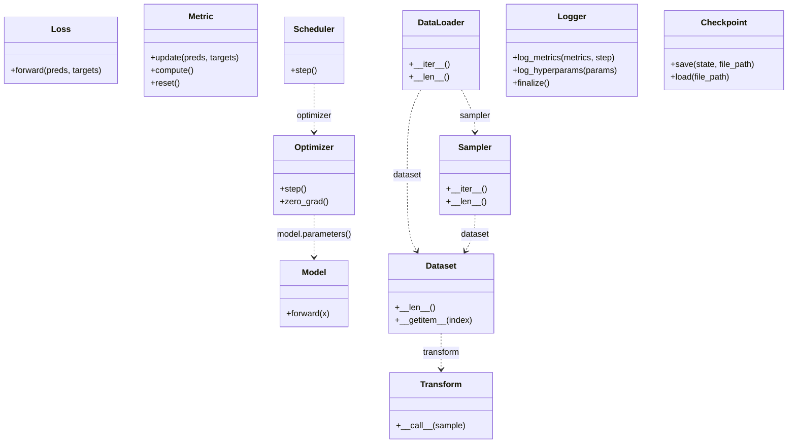

# CVLab-Kit

PyTorch 기반 간단하게 확장 가능한 프로토타이핑 프레임워크


## Overview

이 프로젝트는 PyTorch 기반의 경량 모듈형 실험 프레임워크로, **에이전트(Agent) 중심 구조**를 바탕으로 실험 구성 요소(Component)들을 **Creator 클래스를 통해 동적으로 생성**하며, 설정 파일(YAML)을 기반으로 재현성과 구성 유연성을 모두 갖춘 실험 환경을 제공합니다.

## Key Feature

| 기능 | 설명 |
|------|------|
| **Agent‑Centric Workflow** | 학습, 검증, 평가 루프를 에이전트 중심으로 관리 |
| **Dynamic Component Factory** | `create.<component>.<key>()`의 형태로<br>모델·옵티마이저·데이터셋 등의 구성 요소를 동적으로 로딩 및 생성 |
| **Dry‑run Validation** | 학습 전에 구성이 올바른지 검증하여, 학습 도중 중단 문제를 사전에 방지 |
| **Grid Search** | YAML에 구성된 다중 값들이 자동으로 실험 조합으로 확장되어 반복 실험 |
| **Zero‑Boilerplate** | 컴포넌트 구현 시 반복 코드 없이 InterfaceMeta로 구조 자동 통일 |


## Component Interface System: Based on metaclass

모든 컴포넌트(Optimizer, Model, Loss 등)는 `InterfaceMeta`라는 커스텀 메타클래스를 사용하는 공통 추상 클래스를 기반으로 구현됩니다. 개발자가 세 가지 다른 방식의 컴포넌트를 통일성 있게 구현할 수 있도록 지원합니다.

### InterfaceMeta 핵심 동작

- 컴포넌트 추상 클래스는 PyTorch 클래스(e.g., torch.optim.Optimizer)를 상속할 수 있음.
- 구현체에서 직접 해당 추상 클래스를 상속하거나, 내부에 기 구현체를 통해, 위임 대상 객체를 지정하면 자동으로 메서드 위임
- 최종적으로 Creator는 사용자 구현 방식에 관계없이 동일한 방식으로 해당 객체를 사용할 수 있음

### 지원하는 3가지 구현 패턴

1.  **직접 구현 (Direct Implementation)**
    *   **언제 사용하나요?** 완전히 새로운 기능을 만들거나, PyTorch의 `nn.Module`와 같은 클래스를 상속받고, 필요한 메서드를 직접 구현하여 기능을 확장할 때.
    *   **어떻게 하나요?** 컴포넌트 추상 클래스(예: `Model`, `Optimizer`, `Dataset`, `DataLoader`, `Scheduler`, `Loss`, `Transform` 등)를 상속받고, `@abstractmethod`로 정의된 모든 필수 메서드를 직접 구현합니다. 이 때, `base`의 추상 클래스 자체가 이미 PyTorch의 관련 클래스를 상속하고 있을 수 있으므로, 해당 PyTorch 클래스의 메서드 시그니처를 따르는 것이 중요합니다.
    *   **예시 (Optimizer):**
        ```python
        class MyCustomOptimizer(Optimizer):
            def step(self):
                # custom step
                ...
        ```

2.  **구현체 합성 (Composition / Delegation)**
    *   **언제 사용하나요?** `torch.optim.Adam`과 같은 기존 라이브러리 구현을 재사용하거나 일부 동작만 바꾸고 싶을 때.
    *   **어떻게 하나요?** 우리 컴포넌트(`Optimizer` 등)를 상속받은 클래스의 `__init__` 메서드 안에서, 재사용할 라이브러리 객체를 `self`의 속성으로 할당합니다. (예: `self.optimizer = torch.optim.Adam(...)`). 직접 구현하지 않은 메서드는 `self.optimizer`로 자동 위임되고, 추가 구현한 메서드는 오버라이딩 됨.
    *   **예시:**
        ```python
        import torch.optim as optim
        from cvlabkit.component.base import Optimizer

        class AdamWithLogging(Optimizer):
            def __init__(self, params, lr):
                self.optimizer = optim.Adam(params, lr)

            def step(self):
                # step 메서드는 직접 오버라이드하여 기능 변경
                print("Performing an optimization step...")
                self.optimizer.step()
        ```
        *    위 예시에서 `AdamWithLogging`의 `step`은 직접 구현한 코드가 실행되고, `zero_grad`와 같은 다른 모든 메서드는 `self.optimizer`의 것이 자동으로 호출됩니다.

3.  **순수 인터페이스 (Pure Interface)**
    *   **언제 사용하나요?** 실제 구현 없이, 여러 컴포넌트가 따라야 할 메서드 시그니처만 정의하고 싶을 때.
    *   **어떻게 하나요?** 추상 클래스를 정의하기만 하고, 인스턴스화하지 않으면 됩니다. 이 인터페이스를 상속받는 모든 자식 클래스는 위 1번 또는 2번 방식으로 구현해야 합니다.

이 시스템 덕분에, 개발자는 보일러플레이트 코드 없이 상황에 가장 적합한 방식으로 컴포넌트를 구현하는 데만 집중할 수 있습니다.


## Component Dependency Diagram

다음은 CVLab-Kit의 핵심 컴포넌트 간의 주요 생성자 의존성을 나타낸 다이어그램입니다. 각 컴포넌트는 독립적으로 정의되지만, 생성 시점에 다른 컴포넌트를 필요로 하는 경우가 있습니다.




## Installation

### 1. uv 설치

```bash
pip install uv
```

### 2. 프로젝트 클론

```bash
git clone https://github.com/deveronica/cvlab-kit.git && cd cvlab-kit
```

### 3. 의존성 설치

```bash
uv sync
```

> **uv**는 Poetry·pip‑tools와 비슷한 UX를 제공하면서도 의존성 해석과 빌드를 Rust로 가속화한 도구입니다.

## Quick Start

### 1. Dry-run or Generate Template

- ~~구성이 완전하지 않으면 Dry-run 과정에서 자동으로 `templates/generated.yaml` 생성~~(미구현)
- `python3 config/generate_template.py`를 통해, `config/templates` 폴더에 `generated_basic.yaml` 파일 생성

### 2. Write YAML Configuration

YAML 설정 파일을 작성합니다.

### 3. Run Experiment

설정을 검증하고 실험을 진행합니다. (현재 generate_template.py를 통한 수동 생성 후 --fast 옵션으로 진행)

```python
uv run main.py --config config/example.yaml --fast
```

## Documentation

더 자세한 내용은 다음 문서를 참조하세요:

*   [아키텍처 개요](docs/architecture.md)
*   [개발 철학](docs/development_philosophy.md)
*   [설정 가이드](docs/config_guide.md)
*   [컴포넌트 확장](docs/extending_components.md)
*   [추가 라이브러리](docs/additional_libraries.md)