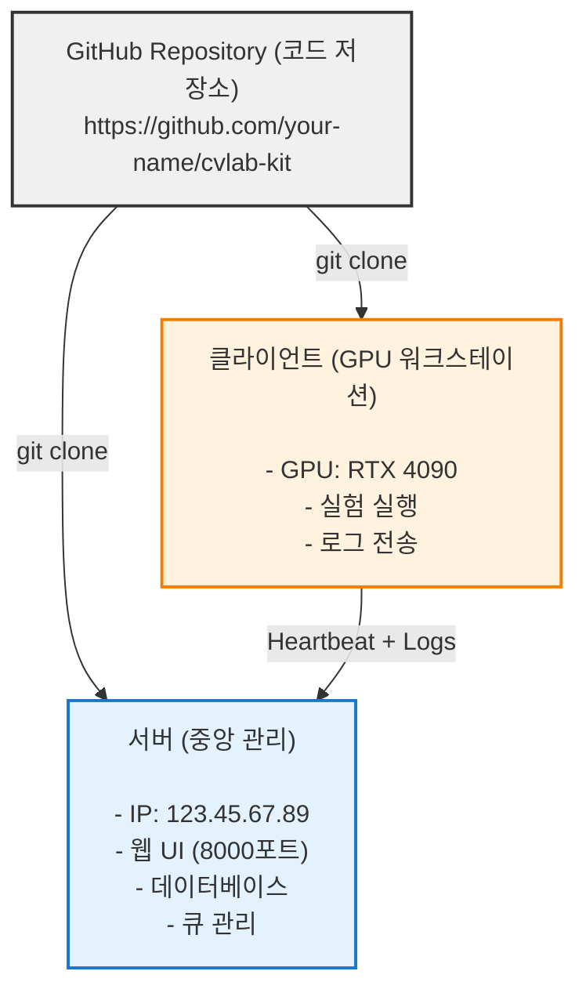

# 배포 가이드

> GitHub 배포부터 서버 설정, 원격 GPU 클라이언트 연결까지

## 📋 목차

1. [개념 이해](#1-개념-이해)
2. [GitHub 배포](#2-github-배포)
3. [서버 배포](#3-서버-배포)
4. [클라이언트 연결](#4-클라이언트-연결)
5. [실전 시나리오](#5-실전-시나리오)

---

## 1. 개념 이해

### 시스템 구조



### 역할 구분

| 컴포넌트 | 역할 | 실행 위치 | 필요한 것 |
|---------|------|----------|----------|
| **서버** | 웹 UI 제공, 큐 관리, 로그 수집 | 클라우드 서버 또는 연구실 서버 | 공인 IP, 포트 개방 |
| **클라이언트** | GPU로 실험 실행, 결과 전송 | GPU 워크스테이션 | GPU, 서버 접속 권한 |
| **GitHub** | 코드 저장 및 버전 관리 | GitHub 서버 | Git, GitHub 계정 |

---

## 2. GitHub 배포

### 2.1 리포지토리 생성

#### 옵션 A: GitHub 웹사이트에서 생성
1. https://github.com 접속 → 로그인
2. 우측 상단 **+** → **New repository**
3. Repository 이름 입력 (예: `cvlab-kit`)
4. **Public** 또는 **Private** 선택
5. **Create repository** 클릭

#### 옵션 B: 기존 프로젝트를 GitHub에 올리기

**1. 현재 프로젝트 디렉토리로 이동**:
```bash
cd /Users/deveronica/dev/python/cvlab-kit
```

**2. Git 초기화** (이미 되어있으면 skip):
```bash
git init
```

**3. GitHub 리포지토리 연결**:
```bash
git remote add origin https://github.com/your-username/cvlab-kit.git
```

**4. 커밋 및 푸시**:
```bash
git add .
git commit -m "Initial commit: CVLab-Kit project"
git push -u origin main
```

### 2.2 .gitignore 설정

배포 전에 불필요한 파일 제외:

**.gitignore 파일 편집**:
```bash
cat >> .gitignore <<EOF
# Python
__pycache__/
*.py[cod]
.venv/
.uv/

# Logs and outputs
logs/
outputs/
web_helper/state/db.sqlite
web_helper/queue_logs/
logs_*/

# Node modules
node_modules/
web_helper/frontend/dist/
web_helper/frontend/node_modules/

# OS files
.DS_Store
Thumbs.db

# IDE
.vscode/
.idea/
*.swp
EOF

git add .gitignore
git commit -m "Add .gitignore"
git push
```

---

## 3. 서버 배포

### 3.1 서버 준비

#### 최소 사양 (서버용)
- CPU: 2 cores
- RAM: 4GB
- 디스크: 20GB
- OS: Ubuntu 22.04 LTS (권장)
- 포트: 8000 개방 필요

### 3.2 서버 접속

**SSH로 서버 접속**:
```bash
ssh username@123.45.67.89
```

**또는 키 파일로 접속 (AWS 등)**:
```bash
ssh -i ~/.ssh/my-key.pem ubuntu@123.45.67.89
```

### 3.3 서버 환경 설정

**1. 시스템 업데이트**:
```bash
sudo apt update && sudo apt upgrade -y
```

**2. Python 3.11+ 설치**:
```bash
sudo apt install python3 python3-pip python3-venv -y
```

**3. uv 설치** (패키지 관리자):
```bash
curl -LsSf https://astral.sh/uv/install.sh | sh
source $HOME/.cargo/env
```

**4. Node.js 설치** (프론트엔드 빌드용):
```bash
curl -fsSL https://deb.nodesource.com/setup_20.x | sudo -E bash -
sudo apt install -y nodejs
```

### 3.4 CVLab-Kit 설치

**1. GitHub에서 클론**:
```bash
cd ~
git clone https://github.com/your-username/cvlab-kit.git
cd cvlab-kit
```

**2. 의존성 설치**:
```bash
uv sync
```

**3. 프론트엔드 빌드**:
```bash
cd web_helper/frontend
npm install
npm run build
cd ../..
```

### 3.5 방화벽 설정

> **Platform**: Linux only (Ubuntu/Debian)
> **macOS**: Use `pf` (see [macOS Section](#macos-launchd))
> **Windows**: Use Windows Firewall

**Ubuntu UFW 사용**:
```bash
sudo ufw allow 8000/tcp
sudo ufw allow 22/tcp
sudo ufw enable
sudo ufw status
```

### 3.6 서버 실행 (systemd 서비스 등록)

> **Platform**: Linux only
> **macOS alternative**: See [macOS launchd section](#macos-launchd)
> **Windows alternative**: See [Windows Task Scheduler](#windows-작업-스케줄러)

**systemd 서비스 파일 생성**:
```bash
sudo tee /etc/systemd/system/cvlab-server.service > /dev/null <<EOF
[Unit]
Description=CVLab-Kit Web Server
After=network.target

[Service]
Type=simple
User=$USER
WorkingDirectory=$HOME/cvlab-kit
ExecStart=$(which uv) run app.py --host 0.0.0.0 --port 8000 --server-only
Restart=always
RestartSec=10
Environment="PATH=/home/$USER/.cargo/bin:/usr/bin:/bin"

[Install]
WantedBy=multi-user.target
EOF
```

**서비스 시작**:
```bash
sudo systemctl daemon-reload
sudo systemctl enable cvlab-server
sudo systemctl start cvlab-server
```

**상태 확인**:
```bash
sudo systemctl status cvlab-server
```

**로그 확인**:
```bash
journalctl -u cvlab-server -f
```

### 3.7 웹 UI 접속 확인

**서버 IP 확인**:
```bash
curl ifconfig.me
```

**브라우저에서 접속**: `http://123.45.67.89:8000`

---

## 4. 클라이언트 연결

### 4.1 GPU 워크스테이션 준비

클라이언트는 GPU가 있는 워크스테이션이나 개인 PC에서 실행합니다.

#### 필요한 것:
- GPU (NVIDIA CUDA 또는 Apple Silicon)
- Python 3.11+
- 서버 접속 가능한 네트워크

### 4.2 CVLab-Kit 설치 (클라이언트)

**1. GitHub에서 클론** (서버와 동일):
```bash
cd ~/workspace
git clone https://github.com/your-username/cvlab-kit.git
cd cvlab-kit
```

**2. 의존성 설치**:
```bash
uv sync
```

**3. GPU 지원 패키지 설치** (선택):

NVIDIA GPU:
```bash
uv add nvidia-ml-py
```

PyTorch (GPU 버전이 필요하면):
```bash
uv add torch torchvision --index-url https://download.pytorch.org/whl/cu118
```

### 4.3 클라이언트 에이전트 실행

#### 클라이언트 실행

**클라이언트 실행** (하트비트 + 작업 실행 + 로그 동기화):
```bash
uv run app.py --client-only --url http://123.45.67.89:8000
```

#### 백그라운드 실행

**Linux (systemd)**

> **Platform**: Linux only

**서비스 파일 생성**:
```bash
sudo tee /etc/systemd/system/cvlab-client.service > /dev/null <<EOF
[Unit]
Description=CVLab-Kit Client
After=network.target

[Service]
Type=simple
User=$USER
WorkingDirectory=$HOME/workspace/cvlab-kit
ExecStart=$(which uv) run app.py \
    --client-only \
    --url http://123.45.67.89:8000 \
    --client-host-id $(hostname)
Restart=always
RestartSec=10
Environment="PATH=/home/$USER/.cargo/bin:/usr/bin:/bin"

[Install]
WantedBy=multi-user.target
EOF
```

**서비스 시작**:
```bash
sudo systemctl daemon-reload
sudo systemctl enable cvlab-client
sudo systemctl start cvlab-client
```

**상태 확인**:
```bash
sudo systemctl status cvlab-client
journalctl -u cvlab-client -f
```

**macOS (launchd)**

> **Platform**: macOS only
> **Verified**: ✅ Works on macOS

**LaunchAgent 파일 생성**:
```bash
tee ~/Library/LaunchAgents/com.cvlabkit.client.plist > /dev/null <<EOF
<?xml version="1.0" encoding="UTF-8"?>
<!DOCTYPE plist PUBLIC "-//Apple//DTD PLIST 1.0//EN" "http://www.apple.com/DTDs/PropertyList-1.0.dtd">
<plist version="1.0">
<dict>
    <key>Label</key>
    <string>com.cvlabkit.client</string>
    <key>ProgramArguments</key>
    <array>
        <string>$(which uv)</string>
        <string>run</string>
        <string>app.py</string>
        <string>--client-only</string>
        <string>--url</string>
        <string>http://123.45.67.89:8000</string>
        <string>--client-host-id</string>
        <string>$(hostname)</string>
    </array>
    <key>WorkingDirectory</key>
    <string>$HOME/workspace/cvlab-kit</string>
    <key>RunAtLoad</key>
    <true/>
    <key>KeepAlive</key>
    <true/>
    <key>StandardOutPath</key>
    <string>/tmp/cvlab-client.log</string>
    <key>StandardErrorPath</key>
    <string>/tmp/cvlab-client-error.log</string>
</dict>
</plist>
EOF
```

**서비스 시작**:
```bash
launchctl load ~/Library/LaunchAgents/com.cvlabkit.client.plist
launchctl start com.cvlabkit.client
```

**로그 확인**:
```bash
tail -f /tmp/cvlab-client.log
```

**Windows (작업 스케줄러)**

> **Platform**: Windows only

1. 배치 파일 생성 (`C:\cvlab-kit\start-client.bat`):
```batch
@echo off
cd C:\cvlab-kit
uv run app.py --client-only --url http://123.45.67.89:8000
```

2. 작업 스케줄러 등록:
   - Win+R → `taskschd.msc`
   - 작업 만들기 → 트리거: 시스템 시작 시
   - 동작: `C:\cvlab-kit\start-client.bat` 실행

### 4.4 연결 확인

1. 웹 UI 접속: `http://123.45.67.89:8000`
2. **Devices** 탭 클릭
3. 클라이언트 상태 확인:
   - Status: **healthy** (초록색) ✅
   - GPU 사용률, VRAM, 온도 표시됨

---

## 5. 다중 클라이언트 설정 예시

**서버 실행**
```bash
uv run app.py --host 0.0.0.0 --port 8000 --server-only
```

**클라이언트 1**
```bash
uv run app.py --client-only \
    --url http://server-ip:8000 \
    --client-host-id gpu-01
```

**클라이언트 2**
```bash
uv run app.py --client-only \
    --url http://server-ip:8000 \
    --client-host-id gpu-02
```

---

## 6. 트러블슈팅

### 문제 1: 클라이언트가 "disconnected"

**원인**: 네트워크 연결 실패 또는 방화벽 차단

**해결**:

**1. 서버 핑 테스트**:
```bash
ping 123.45.67.89
```

**2. 포트 접근 테스트**:
```bash
curl http://123.45.67.89:8000/api/devices
```

**3. 방화벽 확인**:

Linux:
```bash
sudo ufw status
```

Windows:
```bash
netsh advfirewall show allprofiles
```

**4. 클라이언트 로그 확인**:

Linux:
```bash
journalctl -u cvlab-client -f
```

macOS:
```bash
tail -f /tmp/cvlab-client.log
```

### 문제 2: 서버 접속 안 됨 (Connection refused)

**원인**: 서버 미실행 또는 포트 바인딩 실패

**해결**:

**서버에서 실행 중인지 확인**:
```bash
sudo systemctl status cvlab-server
```

**포트 사용 확인**:
```bash
sudo netstat -tulpn | grep 8000
```

**서비스 재시작**:
```bash
sudo systemctl restart cvlab-server
```

### 문제 3: 프론트엔드 빌드 실패

**원인**: Node.js 버전 불일치 또는 의존성 문제

**해결**:

**Node.js 버전 확인** (20.x 이상 필요):
```bash
node --version
```

**캐시 삭제 후 재설치**:
```bash
cd web_helper/frontend
rm -rf node_modules package-lock.json
npm install
npm run build
```

### 문제 4: GitHub 푸시 권한 오류

**원인**: SSH 키 미설정 또는 HTTPS 인증 실패

**해결**:

**SSH 키 생성**:
```bash
ssh-keygen -t ed25519 -C "your_email@example.com"
```

**공개키 복사**:
```bash
cat ~/.ssh/id_ed25519.pub
```

**GitHub Settings → SSH Keys에 등록**: https://github.com/settings/keys

**리포지토리 URL 변경** (HTTPS → SSH):
```bash
git remote set-url origin git@github.com:your-username/cvlab-kit.git
```

---

## 7. 다음 단계

배포 완료 후:

1. **웹 UI 접속**: `http://your-server:8000`
2. **실험 실행**: [Distributed Execution Quick Start](distributed_execution_quickstart.md)
3. **고급 기능**: [Distributed Execution Guide](distributed_execution_guide.md)

---

## 참고 자료

- [Architecture](architecture.md) - 프로젝트 아키텍처
- [Distributed Execution Guide](distributed_execution_guide.md) - 분산 실행 상세 가이드
- [User Guide (Experimenter)](user_guide_experimenter.md) - 실험자 가이드
