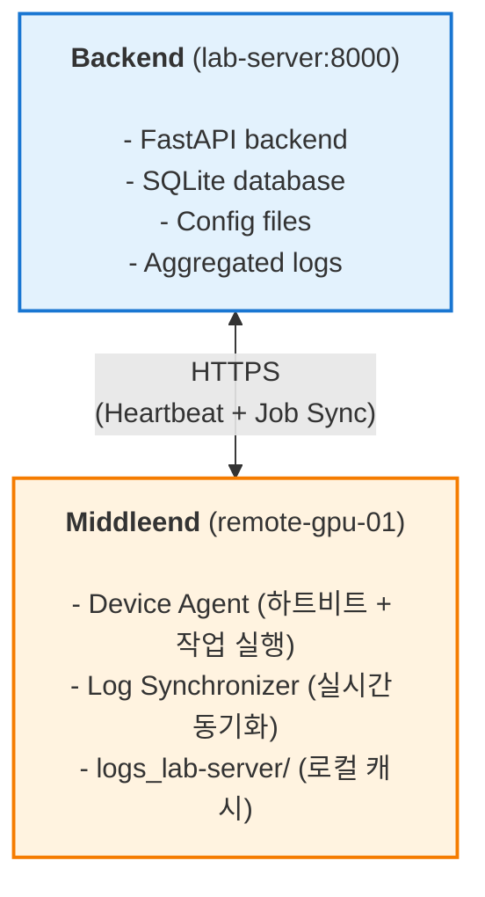

# 분산 실행

> 여러 GPU 서버에서 실험 자동 분배 및 실시간 로그 동기화

## 개요

### 아키텍처



### 주요 기능

1. **실시간 하트비트**: 10초마다 GPU 상태 전송
2. **자동 작업 디스패치**: 유휴 GPU에 자동 배정
3. **증분 로그 동기화**: CSV는 delta만, YAML/PT는 전체 전송
4. **재연결 복구**: 네트워크 단절 후 자동 재개
5. **멀티 서버 지원**: 여러 서버에 동시 연결 가능

---

## 설치 및 설정

### 1. 서버 설정

#### 1.1 웹 서버 실행

```bash
cd /path/to/cvlab-kit
uv run app.py --dev
```

또는 백엔드만 실행:
```bash
uv run app.py
```

#### 1.2 데이터베이스 마이그레이션

**분산 실행 필드 추가**:
```bash
uv run python web_helper/backend/migrations/add_distributed_sync_fields.py
```

#### 1.3 방화벽 설정 (선택사항)

> **Platform-specific**: Different commands for each OS

외부 접속을 허용하려면 8000번 포트를 개방하세요.

**Linux (iptables)**:
```bash
sudo iptables -A INPUT -p tcp --dport 8000 -j ACCEPT
```

**macOS (pf)** - `/etc/pf.conf`에 다음 라인 추가:
```
pass in proto tcp from any to any port 8000
```

---

### 2. Middleend 설정 (GPU 서버)

#### 2.1 필수 패키지 설치

**CVLab-Kit 클론** (Middleend에도 필요):
```bash
git clone <cvlab-kit-repo>
cd cvlab-kit
```

**의존성 설치**:
```bash
uv sync
```

**GPU 모니터링 패키지** (선택사항):
```bash
uv add nvidia-ml-py
```

#### 2.2 Middleend 실행

**일반 모드** (하트비트 + 작업 실행 + 로그 동기화):
```bash
uv run app.py --client-only --url https://lab-server:8000
```

**Daemon 모드** (SSH 세션 독립, 백그라운드 실행):
```bash
uv run app.py --client-only --url https://lab-server:8000 --daemon
```

커스텀 host ID 지정:
```bash
uv run app.py --client-only \
    --url https://lab-server:8000 \
    --client-host-id gpu-workstation-01
```

하트비트/폴링 주기 조정:
```bash
uv run app.py --client-only \
    --url https://lab-server:8000 \
    --client-interval 5 \
    --poll-interval 3
```

#### 2.3 Daemon 모드 (권장)

**장점**:
- SSH 세션 종료 후에도 프로세스 유지
- 프로세스 상태 관리 (start, stop, status)
- 로그 파일 자동 저장

**Daemon 시작**:
```bash
uv run app.py --client-only --url https://lab-server:8000 --daemon
```

**상태 확인**:
```bash
uv run app.py --status
```

**Daemon 중지**:
```bash
uv run app.py --stop
```

**로그 확인**:
```bash
tail -f logs/middleend.log
tail -f logs/middleend.err
```

#### 2.4 systemd 서비스 (대안)

> **Platform**: Linux only

Daemon 모드 대신 systemd를 사용할 수도 있습니다.

**서비스 파일 생성** (Linux):
```bash
sudo tee /etc/systemd/system/cvlab-middleend.service > /dev/null <<EOF
[Unit]
Description=CVLab-Kit Middleend
After=network.target

[Service]
Type=simple
User=$USER
WorkingDirectory=$(pwd)
ExecStart=$(which uv) run app.py --client-only --url https://lab-server:8000
Restart=always
RestartSec=10

[Install]
WantedBy=multi-user.target
EOF

sudo systemctl enable cvlab-middleend
sudo systemctl start cvlab-middleend
sudo systemctl status cvlab-middleend
```

**로그 확인**:
```bash
journalctl -u cvlab-middleend -f
```

**macOS (launchd)**

> **Platform**: macOS only
> **Verified**: ✅ Works on macOS

**~/Library/LaunchAgents/com.cvlabkit.client.plist 생성**:
```bash
tee ~/Library/LaunchAgents/com.cvlabkit.client.plist > /dev/null <<EOF
<?xml version="1.0" encoding="UTF-8"?>
<!DOCTYPE plist PUBLIC "-//Apple//DTD PLIST 1.0//EN" "http://www.apple.com/DTDs/PropertyList-1.0.dtd">
<plist version="1.0">
<dict>
    <key>Label</key>
    <string>com.cvlabkit.client</string>
    <key>ProgramArguments</key>
    <array>
        <string>$(which uv)</string>
        <string>run</string>
        <string>app.py</string>
        <string>--client-only</string>
        <string>--url</string>
        <string>https://lab-server:8000</string>
    </array>
    <key>WorkingDirectory</key>
    <string>$(pwd)</string>
    <key>RunAtLoad</key>
    <true/>
    <key>KeepAlive</key>
    <true/>
    <key>StandardOutPath</key>
    <string>/tmp/cvlab-client.log</string>
    <key>StandardErrorPath</key>
    <string>/tmp/cvlab-client-error.log</string>
</dict>
</plist>
EOF

launchctl load ~/Library/LaunchAgents/com.cvlabkit.client.plist
launchctl start com.cvlabkit.client
```

---

## 사용 방법

> **Note**: Distributed features require multiple machines with network connectivity.
> Single-machine testing is limited to API endpoints and heartbeat functionality.

### 1. 디바이스 확인

웹 UI의 **Devices** 탭에서 연결된 GPU 서버를 확인합니다.

- **Status**: healthy (정상), stale (연결 불안정), disconnected (오프라인)
- **GPU Utilization**: 현재 GPU 사용률
- **VRAM**: 사용 중/전체 VRAM
- **Temperature**: GPU 온도

### 2. 실험 실행

#### 2.1 Execute 탭에서 실험 추가
1. **Config Path** 입력 (예: `config/my_experiment.yaml`)
2. **Project** 이름 입력
3. **Add to Queue** 클릭

#### 2.2 자동 디스패치
- Queue Manager가 유휴 GPU를 찾아 자동으로 작업 할당
- **healthy** 상태의 디바이스만 선택 (3초 내 하트비트)
- 디바이스당 1개의 작업만 실행 (동시성 제한)

### 3. 로그 모니터링

#### 3.1 실시간 모니터링 (Projects 탭)
- 실험 진행 상황 자동 갱신 (SSE 통해 푸시)
- **server_origin**: `local` (서버 실행) 또는 `remote-{host_id}` (원격 실행)
- **sync_status**: `synced` (동기화 완료), `syncing` (동기화 중), `outdated` (지연됨)

#### 3.2 로그 파일 위치

**서버 측**:
```
logs/
└─ {project}/
   ├─ run_001.yaml    # 메타데이터
   ├─ run_001.csv     # 메트릭 (동기화된 결과)
   └─ run_001.pt      # 체크포인트
```

**클라이언트 측**:
```
logs_lab-server/         # 서버별 작업 공간
├─ {project}/
│  ├─ run_001.csv       # 로컬 버퍼 (실행 중)
│  ├─ run_001.yaml
│  └─ run_001.pt
├─ .sync_state.json     # 동기화 상태
└─ {experiment_uid}_config.yaml  # 다운로드된 config
```

---

## 고급 기능

### 1. 재연결 복구

#### 시나리오: 네트워크 일시 단절
```
1. 클라이언트에서 실험 계속 실행 (로컬 버퍼에 기록)
2. 네트워크 복구 감지
3. 서버에 동기화 상태 질의 (GET /api/sync/status/{experiment_uid})
4. mtime + size 비교 → 누락 구간 계산
5. 일괄 delta 업로드
6. sync_status: "outdated" → "synced"
```

#### 수동 복구
```python
## 서버에서 동기화 상태 확인
curl https://lab-server:8000/api/sync/status/{experiment_uid}

## 응답 예시:
{
  "data": {
    "experiment_uid": "20251023_a1b2",
    "sync_status": "outdated",
    "files": {
      "run_001.csv": {"mtime": 1729677000, "size": 2048}
    }
  }
}
```

### 2. 다중 서버 연결

동일한 GPU 서버가 여러 웹 서버에 동시 연결 가능:

```bash
## Terminal 1: 서버 A에 연결
uv run python -m web_helper.client.device_agent \
    --server https://server-a:8000 \
    --host-id gpu-01

## Terminal 2: 서버 B에 연결 (다른 프로세스)
uv run python -m web_helper.client.device_agent \
    --server https://server-b:8000 \
    --host-id gpu-01
```

로그는 자동으로 분리됨:
```
logs_server-a/
logs_server-b/
```

---

## 트러블슈팅

### 문제 1: 디바이스가 "disconnected" 상태

**원인**: 하트비트가 3초 이상 수신되지 않음

**해결**:

**클라이언트에서 agent 로그 확인**:
```bash
journalctl -u cvlab-agent -f
```

**네트워크 연결 확인**:
```bash
ping lab-server
```

**Agent 재시작**:
```bash
sudo systemctl restart cvlab-agent
```

### 문제 2: 로그 동기화 지연

**원인**: 네트워크 대역폭 부족 또는 방화벽 제한

**해결**:

**동기화 상태 확인**:
```bash
cat logs_lab-server/.sync_state.json
```

**수동으로 파일 업로드**:
```bash
curl -X POST https://lab-server:8000/api/sync/full/{experiment_uid}/run_001.csv \
     -F "file=@logs_lab-server/project/run_001.csv"
```

**방화벽 확인**:
```bash
sudo ufw status
```

### 문제 3: 작업이 디스패치되지 않음

**원인**: 디바이스가 "healthy" 상태가 아니거나, 이미 작업 실행 중

**해결**:

Devices 탭에서 상태 확인 (3초 내 하트비트 필요)

**하트비트 주기 단축 시도**:
```bash
uv run python -m web_helper.client.device_agent \
    --server https://lab-server:8000 \
    --heartbeat-interval 3
```

Queue 탭에서 작업 상태 확인

---

## API 레퍼런스

### Sync API 엔드포인트

#### POST /api/sync/delta/{experiment_uid}/{file_name}
CSV 파일의 증분 업로드 (append-only)

**Request**:
```
POST /api/sync/delta/20251023_a1b2/run_001.csv
Content-Type: multipart/form-data

delta: <binary content>
```

**Response**:
```json
{
  "success": true,
  "data": {
    "message": "Delta synced successfully",
    "bytes_synced": 1024
  }
}
```

#### POST /api/sync/full/{experiment_uid}/{file_name}
파일 전체 업로드 (YAML/PT)

**Request**:
```
POST /api/sync/full/20251023_a1b2/run_001.yaml
Content-Type: multipart/form-data

file: <binary content>
```

#### GET /api/sync/status/{experiment_uid}
동기화 상태 질의 (재연결 시 사용)

**Response**:
```json
{
  "success": true,
  "data": {
    "experiment_uid": "20251023_a1b2",
    "sync_status": "synced",
    "last_sync_at": "2025-10-23T10:30:00Z",
    "files": {
      "run_001.csv": {
        "mtime": 1729677000,
        "size": 2048,
        "synced_at": "2025-10-23T10:30:00Z"
      }
    }
  }
}
```

#### POST /api/sync/checkpoint/{experiment_uid}
복구 체크포인트 저장

**Request**:
```json
{
  "epoch": 5,
  "step": 1000,
  "best_accuracy": 0.92
}
```

---

## 성능 최적화

### 1. 동기화 주기 조정
```python
## log_synchronizer.py에서 수정
SYNC_INTERVAL = 2  # 2초마다 동기화 (기본값)

## 네트워크 대역폭이 충분하면 단축
SYNC_INTERVAL = 1

## 대역폭이 부족하면 연장
SYNC_INTERVAL = 5
```

### 2. 압축 전송 (향후 구현)
큰 체크포인트 파일의 경우 gzip 압축 사용

### 3. 배치 업로드
여러 파일을 한 번에 업로드하여 HTTP 오버헤드 감소

---

## FAQ

### Q1: 여러 GPU를 가진 서버에서 작업을 병렬 실행할 수 있나요?
**A**: 현재는 디바이스당 1개의 작업만 실행됩니다.

### Q2: 로그 파일이 너무 커지면 어떻게 되나요?
**A**: Delta sync는 변경된 부분만 전송하므로 네트워크 부담이 적습니다. 완료된 실험의 로그는 주기적으로 아카이빙하세요.

### Q3: 서버와 클라이언트의 CVLab-Kit 버전이 달라도 되나요?
**A**: 권장하지 않습니다. Config 파싱이나 Component 호환성 문제가 발생할 수 있습니다.

### Q4: 한 서버에 여러 Device Agent를 실행할 수 있나요?
**A**: 네, 가능합니다. 각 Agent에 다른 `--host-id`를 지정하세요.

---

## 다음 단계

- [ ] 실험 실행 완료 시 슬랙 알림
- [ ] Prometheus 메트릭 익스포트
- [ ] 동적 GPU 할당 (멀티 GPU 병렬 실행)
- [ ] WebSocket 기반 실시간 로그 스트리밍
- [ ] 체크포인트 기반 자동 재개

---

## 참고 자료

- [Architecture](architecture.md) - 프로젝트 아키텍처
- [User Guide (Experimenter)](user_guide_experimenter.md) - 실험자 가이드

---

## 관련 문서

- [빠른 시작](distributed_execution_quickstart.md)
- [배포 가이드](deployment_guide.md)
- [Web Helper 가이드](web_helper_guide.md)
