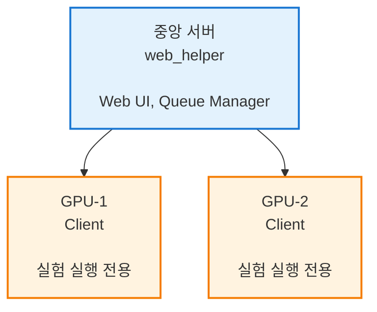

# 분산 실행 환경 구축하기

이 튜토리얼에서는 여러 GPU 서버를 활용하여 CVLab-Kit을 분산 환경에서 실행하는 방법을 배웁니다.

## 시나리오

> **Note**: This tutorial requires multiple machines with network connectivity and NVIDIA GPUs.
> For single-machine testing, see the verification report in `reports/2025-11-20_verification_macOS.md`.

연구실에 다음과 같은 환경이 있다고 가정합니다:

- **중앙 서버** (관리용): Web UI 제공, 큐 관리
- **GPU 서버 1**: NVIDIA RTX 4090 x 2
- **GPU 서버 2**: NVIDIA RTX 4090 x 4

## 아키텍처



## 1단계: 중앙 서버 설정

### 설치

**중앙 서버에서**:
```bash
git clone https://github.com/deveronica/cvlab-kit.git
cd cvlab-kit
uv sync
```

### 서버 모드 실행

**서버 전용 모드** (실험 실행 없이 관리만):
```bash
uv run app.py --server-only --host 0.0.0.0 --port 8000
```

**중요**: `--server-only` 플래그를 사용하면 로컬에서 실험을 실행하지 않고 큐 관리와 Web UI만 제공합니다.

### 방화벽 설정

> **Platform**: Linux only

**Ubuntu/Debian**:
```bash
sudo ufw allow 8000/tcp
```

**CentOS/RHEL**:
```bash
sudo firewall-cmd --permanent --add-port=8000/tcp
sudo firewall-cmd --reload
```

## 2단계: GPU 클라이언트 설정

각 GPU 서버에서 동일한 작업을 수행합니다.

### 설치

**GPU 서버 1, 2에서 각각**:
```bash
git clone https://github.com/deveronica/cvlab-kit.git
cd cvlab-kit
uv sync
```

### 환경 변수 설정 (선택사항)

**~/.bashrc 또는 ~/.zshrc에 추가**:
```bash
export CVLAB_SERVER_URL="http://central-server-ip:8000"
export CVLAB_DEVICE_ID="gpu-server-1"
```

각 서버마다 고유 ID 필요

### 클라이언트 모드 실행

**클라이언트 모드** (heartbeat + 실험 실행 + 로그 동기화):

```bash
uv run app.py --client-only --url http://central-server-ip:8000
```

**설명**:
- `--client-only`: Web UI를 실행하지 않고 백그라운드 클라이언트로만 동작
- Heartbeat를 3초마다 서버에 전송하여 디바이스 상태 보고
- 큐에서 실험을 가져와 실행
- 실행 로그를 서버에 동기화

## 3단계: 실험 제출 및 실행

### Web UI에서 실험 제출

1. 중앙 서버 Web UI 접속: `http://central-server-ip:8000`
2. **Execute** 탭으로 이동
3. YAML 설정 작성:

```yaml
project: distributed_experiment

dataset:
  train: cifar10(split=train, download=true)
  val: cifar10(split=test, download=true)

model: resnet18(num_classes=10)
optimizer: adam(lr=0.001)
loss: cross_entropy
epochs: 100
batch_size: 128

# 특정 디바이스 지정 (선택사항)
# device: cuda:0
```

4. **Add to Queue** 버튼 클릭

### 자동 디바이스 할당

Queue Manager가 다음 기준으로 실험을 자동 할당합니다:

1. **Idle GPU 우선**: 실행 중인 작업이 없는 GPU
2. **메모리 여유**: GPU 메모리 사용량이 낮은 GPU
3. **헬스 체크**: 최근 3초 이내 heartbeat를 보낸 GPU만 선택

## 4단계: 실시간 모니터링

### Devices 탭

Web UI의 **Devices** 탭에서 모든 GPU 서버의 상태를 실시간으로 확인:

- GPU 메모리 사용량
- CPU 사용률
- 현재 실행 중인 실험
- 마지막 heartbeat 시간

### Queue 탭

**Queue** 탭에서 작업 상태 확인:

- **Pending**: 대기 중
- **Running**: 실행 중 (할당된 디바이스 표시)
- **Completed**: 완료
- **Failed**: 실패

### 실시간 로그

실행 중인 실험을 클릭하여 실시간 로그 확인:

```
Epoch [1/100] ━━━━━━━━━━━━━━━━━━━━ 100%
  train_loss: 2.305
  train_acc: 0.100
  val_loss: 2.302
  val_acc: 0.112
```

## 고급: 다중 GPU 학습

단일 서버에서 여러 GPU를 사용:

```yaml
# config/multi_gpu.yaml
project: multi_gpu_training

dataset:
  train: cifar10(split=train, download=true)
  val: cifar10(split=test, download=true)

model: resnet50(num_classes=10)
optimizer: adam(lr=0.001)
loss: cross_entropy

# 다중 GPU 지정
device: [0, 1, 2, 3]  # GPU 0, 1, 2, 3 사용

# 배치 크기는 GPU 수에 맞게 자동 조정됨
batch_size: 512  # 각 GPU에 128씩 분산
epochs: 100
```

**주의**: `device: [0, 1]`로 설정하면 PyTorch DistributedDataParallel이 자동으로 활성화됩니다.

## 고급: 우선순위 설정

중요한 실험에 우선순위 부여:

```python
# REST API 사용
import requests

url = "http://central-server-ip:8000/api/queue/add"
data = {
    "config": """
project: urgent_experiment
model: resnet18(num_classes=10)
optimizer: adam(lr=0.001)
loss: cross_entropy
    """,
    "priority": "high",  # high, normal, low
    "device": "any"
}

response = requests.post(url, json=data)
print(response.json())
```

## 트러블슈팅

### 클라이언트가 연결되지 않을 때

**증상**: Devices 탭에 GPU 서버가 나타나지 않음

**해결**:

**1. 네트워크 연결 확인**:
```bash
ping central-server-ip
```

**2. 포트 접근 확인**:
```bash
curl http://central-server-ip:8000/api/devices/heartbeat
```

**3. 클라이언트 로그 확인**:
```bash
uv run app.py --client-only --url http://central-server-ip:8000
```

### 실험이 할당되지 않을 때

**증상**: 큐에 작업이 pending 상태로 대기

**원인**:
1. 모든 GPU가 사용 중
2. 클라이언트 heartbeat 중단 (3초 타임아웃)
3. GPU 메모리 부족

**해결**:

Devices 탭에서 확인:
- Last heartbeat: 3초 이내여야 함
- Status: "active"여야 함
- GPU memory: 여유 공간 있어야 함

**클라이언트 재시작** (GPU 서버에서):
```bash
pkill -f "app.py --client-only"
uv run app.py --client-only --url http://central-server-ip:8000
```

### 로그가 동기화되지 않을 때

**증상**: Projects 탭에 실험 결과가 나타나지 않음

**해결**:

**1. Reindex 실행**:
```bash
curl -X POST http://central-server-ip:8000/api/projects/reindex
```

또는 Web UI에서 Projects > Reindex 버튼 클릭

**2. 로그 디렉토리 확인**:

GPU 서버에서:
```bash
ls -la logs/
```

중앙 서버에서:
```bash
ls -la logs/
```

**권장**: `--full` 플래그를 사용하여 클라이언트가 자동으로 로그를 중앙 서버에 동기화하도록 설정

## 시스템 서비스로 등록

> **Platform**: Linux only (systemd)
> **macOS**: Use launchd instead (see deployment guide)

클라이언트를 systemd 서비스로 등록하여 자동 시작:

**/etc/systemd/system/cvlab-client.service 생성**:
```
[Unit]
Description=CVLab-Kit Client
After=network.target

[Service]
Type=simple
User=your-username
WorkingDirectory=/path/to/cvlab-kit
ExecStart=/usr/bin/uv run app.py --client-only --url http://central-server-ip:8000 --full
Restart=always
RestartSec=10

[Install]
WantedBy=multi-user.target
```

**활성화**:
```bash
sudo systemctl daemon-reload
sudo systemctl enable cvlab-client
sudo systemctl start cvlab-client
```

**상태 확인**:
```bash
sudo systemctl status cvlab-client
```

## 성능 최적화

### 네트워크 최적화

```yaml
# 큰 배치를 사용하여 네트워크 오버헤드 감소
batch_size: 512
num_workers: 8  # DataLoader 워커 증가
pin_memory: true  # GPU 전송 최적화
```

### 로그 동기화 최적화

```bash
# rsync를 사용한 효율적인 로그 동기화
# GPU 서버에서 cron 설정
# */5 * * * * rsync -avz /path/to/cvlab-kit/logs/ central-server:/path/to/cvlab-kit/logs/
```

## 체크리스트

- [ ] 중앙 서버에 CVLab-Kit 설치
- [ ] `--server-only` 모드로 중앙 서버 실행
- [ ] 방화벽 포트 8000 개방
- [ ] 각 GPU 서버에 CVLab-Kit 설치
- [ ] `--client-only --full` 모드로 클라이언트 실행
- [ ] Web UI Devices 탭에서 클라이언트 확인
- [ ] 테스트 실험 제출 및 실행 확인
- [ ] 로그 동기화 확인

## 다음 단계

- [분산 실행 가이드](../distributed_execution_guide.md)
- [분산 실행 빠른 시작](../distributed_execution_quickstart.md)
- [성능 튜닝 가이드](../performance_tuning.md)
